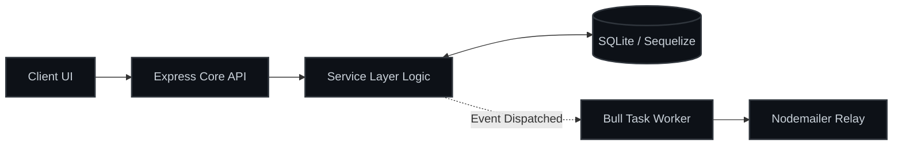

# WoW Mom Support Group Platform 🤱✨

[](./adlc_evaluation_report.md)
[](package.json)
[](src/config/database.js)
[](tests/)

> A highly deterministic, event-driven platform orchestrating the registration, interview scheduling, and structured placement of new mothers into safe, localized peer support groups.

---

## 📖 Overview

**WoW Mom** solves the operational bottlenecks of manual community onboarding. By combining rigid schema validation, asynchronous transactional email pipelines, and strict capacity enforcement rules, the system guarantees smooth candidate progression while preventing local group overbooking.

The core system architecture acts as a secure intermediary serving three distinct personas:

- 🤱 **Mothers:** Search available support structures, manage dynamic meeting preferences, and track live application statuses.
- 🤝 **Group Leaders:** Facilitate peer-to-peer interviews, evaluate prospective members, and oversee automated team rosters.
- 🛡️ **System Administrators:** Authorize onboarding pipelines, inspect system throughput, and monitor overall community health metrics.

---

## ✨ Key Features & Business Rules

### 🔒 Strict Capacity Enforcement

- **Membership Bound Constraints (`BR-2`):** Operational groups strictly maintain a minimum threshold of **2** and an absolute ceiling of **15** active participants.
- **Pessimistic Gating Locks (`BR-3`):** Automatic systemic blocking of inbound requests targeting any group entity operating at maximum capacity. Listings instantly render dynamic `Full` badges across client interfaces.

### 🔄 Multi-Slot Interview Orchestration

- **SLA Timelines (`BR-6`):** Triggers automated interview booking sequences within **7 days** of application creation.
- **Decoupled Messaging:** Leverages asynchronous task workers (`BullMQ`) to dispatch templated candidate invite links via secure transactional SMTP relays.

### 🛡️ Built-in Privacy & Cooldowns

- **Conditional Attribute Hydration (`BR-7`):** Sensitive personal information—including exact telephone contacts and detailed physical addresses—remains fully concealed from peer directories until an application officially transitions to `Active Participant`.
- **Application Flow Control (`BR-1` & `BR-5`):** Restricts applicants to a maximum of **3 concurrent active pipelines** and enforces an automatic **30-day cooldown period** before re-submitting to previously rejected group targets.

---

## 🛠️ System Architecture & Tech Stack



| Layer | Component Technology | Role & Responsibility |
| :--- | :--- | :--- |
| **API Framework** | `Express.js` | REST routing handling cross-platform interface communications. |
| **ORM / Data Tier**| `Sequelize` | Enforces indexing locks, thread-safe increments, and table queries. |
| **Task Queue** | `Bull` | Offloads resource-heavy template rendering and email dispatch. |
| **Authentication** | `bcrypt` + `jsonwebtoken` | Secures access routes via securely hashed credentials and signed tokens. |

---

## 🚀 Getting Started

### 1. Prerequisites

Ensure you have the following installed locally:

- **Node.js** (`v18.0.0` or higher recommended)
- **Git**

### 2. Local Setup & Installation

Clone the repository and install underlying workspace dependencies:

```bash
git clone git@github.com:benthongtiang/wowmom-adlc.git
cd wowmom-adlc
npm install
```

### 3. Environment Configuration

Copy the baseline configuration template to scaffold local environment keys:

```bash
cp .env.example .env
```

*(Ensure valid database and local SMTP connection parameters are mapped inside your newly populated `.env` file).*

### 4. Database Migrations

Initialize local database schema tables:

```bash
npm run migrate
```

### 5. Running the Application

Launch the local development API server:

```bash
npm run dev
```

The server instances will mount and listen on your configured runtime port (defaulting to `http://localhost:3000`).

---

## 🧪 Testing Lifecycle

Execute automated suite coverage validating business rules and model validations:

```bash
npm test
```

---

## 📑 ADLC Verification Status

This project was built and audited under strict adherence to the **Application Development Lifecycle (ADLC)** framework. Every individual lifecycle phase successfully cleared automated testing gates and architectural reviews prior to integration.

👉 **View the full engineering review report:** [ADLC Lifecycle Evaluation Report](./adlc_evaluation_report.md)

---

<div align="center">
  <sub>Built with care to support growing communities. 💖</sub>
</div>
